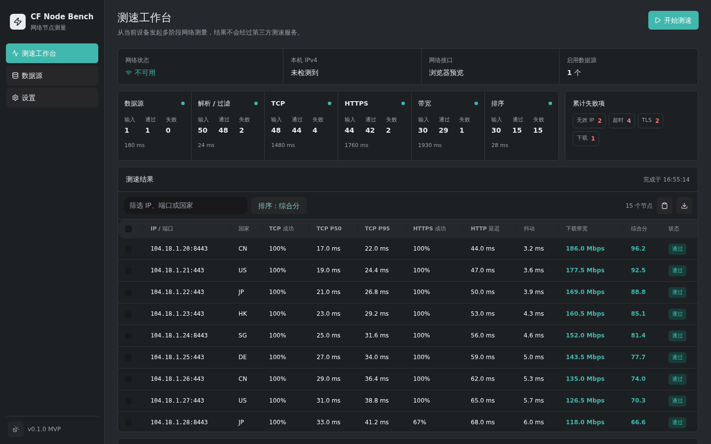

# CF Node Bench

CF Node Bench 是一个跨平台 Cloudflare 候选 IP 测速工具。它在应用实际运行的设备上完成数据源获取、TCP 与 HTTPS 可用性探测、真实下载测速和综合评分，帮助筛选低延迟、高带宽、高可用节点。



## 下载与运行

从 [GitHub Releases](https://github.com/linvva/cf-node-bench/releases) 下载与系统匹配的压缩包，解压后直接运行：

| 系统                        | 下载文件              | 运行方式                                                                       |
| --------------------------- | --------------------- | ------------------------------------------------------------------------------ |
| Windows 10/11 x64           | `windows-amd64.zip`   | 运行 `CF-Node-Bench.exe`，系统需有 WebView2 Runtime                            |
| macOS Intel / Apple Silicon | `macos-universal.zip` | 打开 `CF-Node-Bench.app`；当前构建未签名，首次运行可在 Finder 中右键选择“打开” |
| Linux x64                   | `linux-amd64.tar.gz`  | 运行 `./CF-Node-Bench`，系统需有 GTK3 和 WebKitGTK 4.1 运行库                  |

每个 Release 同时提供 `SHA256SUMS.txt`。压缩包无需安装本应用；系统 WebView、GTK 等桌面运行库不包含在压缩包内。

## 使用方法

1. 打开“数据源”，确认至少启用了一个 HTTP 数据源。内置示例可以修改或删除，也可以添加自己的地址。数据源支持 `IPv4:port#国家代码`、`IPv4:port`、裸 IPv4、空白分隔文本，以及包含 `ip`/`host`、`port`、`country`/`cc` 的 JSON。
2. 打开“设置”，按当前设备和网络调整并发、超时、探测次数、候选池和最大下载量。端口或允许国家为空表示不限；排除国家始终优先于允许国家。
3. 回到“测速工作台”并点击“开始测速”。界面会持续显示数据源、解析/过滤、TCP、HTTPS、带宽和排序阶段的输入、通过、失败、耗时及失败原因；测速过程中可以随时取消。
4. 完成后可在结果表格中排序、筛选、选择、复制或导出。点击任意节点可查看 TCP、HTTPS、带宽和各部分得分明细。

HTTPS 探测通过候选 `IP:port` 建立连接，但 TLS SNI 和 HTTP Host 均使用 `speed.cloudflare.com` 并正常验证证书。TCP 和 HTTPS 成功率是硬门槛，低可用节点不会仅凭高带宽进入最终排名。

## 本地数据与网络

设置、数据源和最近运行历史保存在操作系统标准配置目录下的 `CF Node Bench/data.json`。应用不需要 Python 或外部 `curl`，不包含账号、云同步、DNS 发布或自动更新。

测速会访问用户配置的数据源以及 Cloudflare 的 `speed.cloudflare.com`。结果来自当前运行设备的真实网络环境；浏览器前端预览只使用模拟桥接，不执行真实网络探测。

## 技术栈

- Go 1.26 与 Wails v2.13：探测、调度、评分、存储和桌面容器
- React 19、TypeScript、Vite 8：前端应用
- HeroUI v3 与 Tailwind CSS v4：基础组件、布局和主题
- Apache ECharts：历史与指标图表
- lucide-react：界面图标
- pnpm 11：前端依赖与 workspace 管理

精确依赖版本记录在 `go.sum` 和 `pnpm-lock.yaml`。

## 本地开发

需要 Go 1.26、Node.js 24、pnpm 11、Wails v2.13，以及当前平台的 [Wails 系统依赖](https://wails.io/docs/gettingstarted/installation/)。

```bash
go install github.com/wailsapp/wails/v2/cmd/wails@v2.13.0
pnpm install --frozen-lockfile
wails dev
```

只调试前端时运行：

```bash
pnpm dev
```

## 测试与构建

```bash
go test ./...
pnpm test
pnpm typecheck
pnpm test:e2e
pnpm build
wails build
```

Go 网络测试使用 `httptest` 或本机监听器，不依赖公网。Playwright 覆盖 1280×800 浅色和 1440×900 深色布局。Ubuntu 24.04 使用 WebKitGTK 4.1 构建时需执行：

```bash
wails build -tags webkit2_41
```

## 发布流程

推送以 `v` 开头的版本 Tag 会触发 `.github/workflows/release.yml`。流水线先运行 Go 与前端检查，再并行构建 Windows x64、Linux x64 和 macOS Universal 免安装压缩包，最后创建 GitHub Release 并生成 SHA-256 校验文件。

```bash
git tag -a v0.1.0 -m "v0.1.0"
git push origin v0.1.0
```

## 项目结构

```text
internal/source   HTTP 获取、解析与标准化
internal/probe    TCP、HTTPS、带宽和统计量
internal/ranking  硬门槛、归一化和评分
internal/run      单任务调度、取消和进度事件
internal/storage  设置、数据源和最近历史
frontend/src/features
```

## 致谢

本项目的业务目标和部分配置取舍受到 [xinyitang3/cfnb](https://github.com/xinyitang3/cfnb) 启发。CF Node Bench 没有沿用其 Python 实现，而是使用 Go 与 Wails 重新设计为可取消、可测试的桌面探测流水线。

国家旗帜使用随应用内置的 Twemoji Mozilla 字体离线渲染。第三方字体和图形许可见 `frontend/public/THIRD_PARTY_NOTICES.md`。
